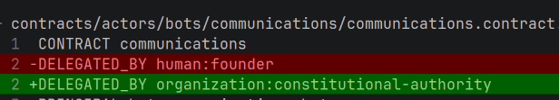

---
{
  "schema": "subactor.doc/v1",
  "id": "docs.readme",
  "version": 4,
  "status": "current",
  "updated": "2026-07-22"
}
---

# docs.subactor.com

Publiczna dokumentacja Subactor.

## Stan architektury i wdrożeń (2026-07-22)

Aktualny przegląd wykonanych prac, dowodów produkcyjnych, otwartych ticketów i
planu refaktoryzacji:
[operations/operational-review-2026-07-21.md](operations/operational-review-2026-07-21.md).

Historyczny raport Plesk i autonomii: [architecture/plesk-publish-status-report-2026-07-19.md](architecture/plesk-publish-status-report-2026-07-19.md).
Szczegółowy rejestr zależności, których platforma nie może utworzyć samodzielnie:
[architecture/unresolved-live-autonomy-blockers-2026-07-19.md](architecture/unresolved-live-autonomy-blockers-2026-07-19.md).
Plan usunięcia blokad i uruchomienia pierwszego kontrolowanego pilota:
[plans/full-platform-remediation-plan-2026-07-19.md](plans/full-platform-remediation-plan-2026-07-19.md).
Projekt domenowy znajduje się w niezależnym repozytorium
`projekty/autonomicznosc-pl`, a źródło publikacji w
`projekty/autonomicznosc-pl/02_landing`. Aktualny stan wdrożenia i pozostałe
blokery opisuje przegląd operacyjny powyżej.

## Autonomy (CLI → connectors)

| Dokument | Opis |
|----------|------|
| [architecture/intent-contract-and-human-machine-source-of-truth-2026-07-22.md](architecture/intent-contract-and-human-machine-source-of-truth-2026-07-22.md) | Decyzja: wspólna intencja człowieka i maszyny jako wersjonowany Intent Contract nad istniejącymi DSL |
| [plans/intent-contract-continuation-2026-07-22.md](plans/intent-contract-continuation-2026-07-22.md) | Plan wdrożenia Intent Contract, source-level lifecycle, równoległych napraw i pętli Doctor/Repair/Validator |
| [architecture/versioned-knowledge-strategy-and-error-runtime-2026-07-22.md](architecture/versioned-knowledge-strategy-and-error-runtime-2026-07-22.md) | Wersjonowana baza wiedzy i registry tekstów, Strategy DSL, Plesk/Cloudflare DNS oraz rzeczywisty stan pętli reakcji ERROR |
| [architecture/autonomy-recommended-solution.md](architecture/autonomy-recommended-solution.md) | **Rekomendacja kanoniczna:** kontrolowany katalog zdolności, strumienie A/B, fazy, werdykt 4 fundamentów |
| [architecture/adr/README.md](architecture/adr/README.md) | ADR Phase 0: zakres autonomii, DNS SSOT, HITL, DoD publish, rollback, sekrety |
| [architecture/autonomy-ops-status-and-open-questions.md](architecture/autonomy-ops-status-and-open-questions.md) | Status ops + pytania otwarte (z proponowanymi odpowiedziami); baseline `5894906` |
| [architecture/intent-orchestration-and-fallbacks.md](architecture/intent-orchestration-and-fallbacks.md) | Intent packs, recipe policy, capability fallbacki, rola LLM (generycznie; publish tylko jako przykład) |
| [architecture/testing-intents-and-deploy-results.md](architecture/testing-intents-and-deploy-results.md) | Macierze testów intent/deploy; ownership vs TestQL; luki capability/verify |
| [architecture/capability-tooling-evaluation.md](architecture/capability-tooling-evaluation.md) | Ocena touri/uri2verify/TestQL/dockfra/hypervisor + gate pack⊆doctor |
| [plans/autonomy-implementation-roadmap.md](plans/autonomy-implementation-roadmap.md) | Roadmapa: fazy 0–8 + kolejność jednostek zmian (PR table) |
| [EQL ↔ autonomy (external)](https://github.com/subactor/eql/blob/main/docs/SUBACTOR_KORU_INTEGRATION.md) | Prototyp EQL 0.2: SemanticPatch + hash ladder vs `plan_hash` / apply grant |
| [autonomy-cli-runbook.md](autonomy-cli-runbook.md) | Runbook: NL z shella (`subactor` / `subactor-run`) → AQL/OQL/URI → Plesk sync; current vs target dla docs.subactor.com |
| [ops/subactor-ask-troubleshooting.md](ops/subactor-ask-troubleshooting.md) | Troubleshooting `subactor ask`: flagi CLI, hr-control, remote_path, origin `--resolve`, Koru vs HITL |
| [plans/docs-subactor-com-publish.md](plans/docs-subactor-com-publish.md) | Plan implementacji: allowlist `docs/`, recipe, NL → publish na docs.subactor.com |
| [plans/intent-capability-fallbacks.md](plans/intent-capability-fallbacks.md) | Skrót / pointer do dokumentu architektury intent + fallbacki |
| [deployment/docs-httpdocs-sync.urirun.json](deployment/docs-httpdocs-sync.urirun.json) | Recipe urirun (dry-run → apply) |

## Platforma (Organization OS)

| Dokument | Opis |
|----------|------|
| [platform/ORGANIZATION_OS_ARCHITECTURE.md](platform/ORGANIZATION_OS_ARCHITECTURE.md) | Warstwy AQL/OQL, Bridge, Control, LLM |
| [platform/BUSINESS_OPERATING_SYSTEM.md](platform/BUSINESS_OPERATING_SYSTEM.md) | Model operacyjny biznesu |
| [platform/TASK_PROCESS_RUNTIME.md](platform/TASK_PROCESS_RUNTIME.md) | Runtime zadań / URI Process |
| [platform/TESTQL_PROJECT_GATES.md](platform/TESTQL_PROJECT_GATES.md) | Bramki TestQL |
| [platform/CODEBASE_HEALTH.md](platform/CODEBASE_HEALTH.md) | **Stan kodu, source of truth, plan refaktoru (code2llm)** |

Szersza dokumentacja operacyjna: [`platform/docs/`](../platform/docs/) w repozytorium platformy (deploy assembly).

## Indeksy analizy kodu

Wygenerowane przez `code2llm` w `project/`:

- `analysis.toon.yaml` — HEALTH, REFACTOR, LAYERS  
- `map.toon.yaml` — mapa modułów  
- `evolution.toon.yaml` — kolejka splitów  
- `context.md` — narracja dla LLM  

Zasady skanowania i triażu mirrorów: [CODEBASE_HEALTH.md](platform/CODEBASE_HEALTH.md).
