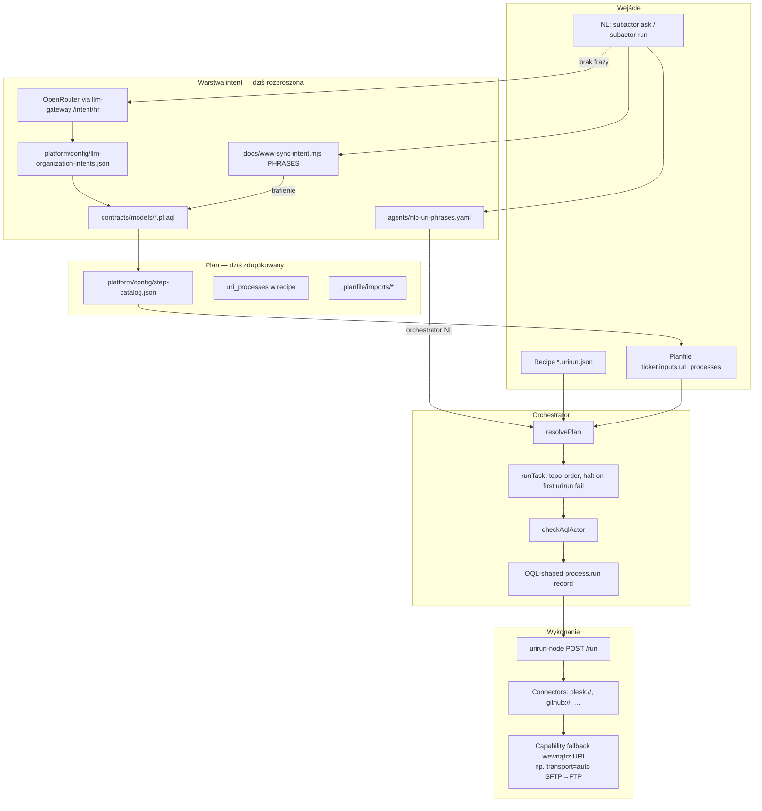

# Architektura: intent packs, orkiestracja i fallbacki zdolności

**Status:** dokument projektowy (analiza + propozycja + **aktualizacja stanu 2026-07-18**).  
Część warstw jest już zaimplementowana — patrz
[`autonomy-implementation-status.md`](./autonomy-implementation-status.md)
(CURRENT / TARGET / LEGACY). Ten plik pozostaje SSOT modelu; nie czytać §1/§2 jako
„nic nie istnieje”, jeśli status mówi inaczej.

**Kanoniczny:** tak — ten plik jest SSOT dla modelu. Krótka nota planowa:
[`../plans/intent-capability-fallbacks.md`](../plans/intent-capability-fallbacks.md).

**Zakres:** wzorce generyczne dla dowolnej domeny (publish, DNS, vault, HTTP check,
GitHub, …). Przykład **docs → Plesk httpdocs** jest tylko ilustracją.

**Powiązane:** [`autonomy-recommended-solution.md`](./autonomy-recommended-solution.md)
(rekomendacja + ADR), [`adr/README.md`](./adr/README.md),
[`../plans/autonomy-implementation-roadmap.md`](../plans/autonomy-implementation-roadmap.md),
[`autonomy-ops-status-and-open-questions.md`](./autonomy-ops-status-and-open-questions.md),
[`../autonomy-cli-runbook.md`](../autonomy-cli-runbook.md),
[`../plans/docs-subactor-com-publish.md`](../plans/docs-subactor-com-publish.md),
[`../../platform/docs/URI_PROCESS_AUTONOMY.md`](../../platform/docs/URI_PROCESS_AUTONOMY.md),
[`../../orchestrator/README.md`](../../orchestrator/README.md).

---

## 1. Problem

Łatwość intencji (NL → działający plan) historycznie blokowały:

1. **N-krotne ręczne podpinanie tego samego celu** — frazy, katalog LLM, model AQL,
   step-catalog, recipe `*.urirun.json`, import Planfile, `ALLOW MODEL` / `ALLOW URI_PROCESS`.
   **CURRENT (PR2–3 partial):** pack registry + derived sync redukują drift; Planfile
   imports nadal ręczne; dual-run do PR10.
2. **Liniowy fail-fast** w `runTask` — pierwsza porażka urirun kończy cały plan.
   **CURRENT (PR4 partial):** `on_fail` / `optional` / retry / timeout działają;
   brak pełnego `try_in_order`; rollback = stub → `rollback_failed`.
3. **Mylenie warstw fallbacku** — transport (SFTP→FTP) należy do konektora;
   alternatywy między URI do recipes/orchestratora; wybór nazwanego intentu do pack/phrase.

Bez SSOT dla **named intent** i **policy między krokami** każdy nowy cel
powiela wiring. **Nie** jest już prawdą „brak packów / tylko fail-fast” — patrz evidence.

---

## 2. Stan obecny (zweryfikowany w kodzie)

### 2.1 Pipeline warstwowy (już dobry)

```text
NL (subactor ask / subactor-run --nl)
  → intent (phrase map | OpenRouter via llm-gateway)     [nazwa modelu + situation]
  → Planfile ticket / recipe  (uri_processes)            [plan]
  → @subactor/orchestrator runTask                       [topo + AQL + OQL intent]
  → urirun-node → connector                              [HOW]
```

Rozdział **Contract AQL (WHO) / OQL (WHAT) / URI (HOW)** jest spójny z
`URI_PROCESS_AUTONOMY.md` i README orchestratora. OpenRouter ma być **tylko
intentem** — upload, vault lease, DNS, HTTP check zostają deterministyczne.

### 2.2 Diagram architektury (as-is)



### 2.3 Co jest zduplikowane

| Warstwa | Lokalizacje (przykład publish) | Objaw / stan |
| --- | --- | --- |
| Frazy NL | **SSOT:** `platform/config/intent-packs/*.v1.json`; generated `agents/nlp-uri-phrases.yaml`; cold fallback w `*-sync-intent.mjs` | Unit 3: pack-first; YAML generowany (`sync-intent-pack-derived.mjs`) |
| Katalog LLM | `llm-organization-intents.json` fields dla docs/www **align** z pack `situation_schema` | Sync/check w skrypcie derived |
| Model AQL | `contracts/models/docs-httpdocs-sync.pl.aql` | Wskazuje jeden `MODUŁY` |
| Step catalog | `create_*_httpdocs_sync_ticket` + pole `recipe` → recipe path | Skeleton check vs recipe; Planfile imports nadal osobna kopia |
| Recipe | `docs/deployment/docs-httpdocs-sync.urirun.json` | Linearna lista; brak policy |
| Planfile | `.planfile/imports/*` + `*.planfile-ticket.yaml` | Nadal kopia kroków (nie auto-rewrite w unit 3) |
| Allow | `ALLOW MODEL` / `ALLOW URI_PROCESS` w contract AQL | Łatwo zapomnieć przy nowym modelu |

Ścieżka kontrolna (`core/.../routes/llm.mjs`): **pack-first** dla docs/www, potem cold
legacy adapters; `pack_compare` dual-run do PR10. Unika misroute do HR/onboarding.

### 2.4 Co już działa dobrze

| Element | Dowód w kodzie / docs | Dlaczego zostawić |
| --- | --- | --- |
| Cienki orchestrator | `orchestrator/src/pipeline.mjs` `runTask` | Glue bez połykania AQL/OQL/connectorów |
| Topo `depends_on` | `orderSteps` w tym samym pliku | Solidna baza pod policy |
| Dry-run domyślnie | `dryRun !== false`; payload `apply: false` | Bezpieczeństwo |
| Brama zapisu | `PLESK_SYNC_APPLY=1` w bridge / docs | Nie przez LLM |
| Allowlist źródeł | basename `www` \| `docs` lub `PLESK_SYNC_ALLOWED_SOURCES` | Deterministyczna polityka |
| Phrase map lokalna | `agents/services/nlp-uri-map.mjs` | Bez patchowania desktop nlp2uri |
| Transport jako capability | Bridge przekazuje `transport: args.transport \|\| "auto"` do urirun; docs: SFTP preferred, FTP fallback | **Nie** dublować jako dwa kroki sync w recipe |
| Contract allow | `project-operator.contract.aql`: `ALLOW MODEL docs-httpdocs-sync.pl.aql`, `ALLOW URI_PROCESS plesk://*` | WHO poza prose recipe |
| OQL cienkie | Orchestrator zapisuje `process.run`, nie magazynuje grafu policy | OQL ≠ SSOT fallbacków |

**Uwaga faktograficzna:** nota planowa wspomina `_TRANSPORT_ORDER` w
`urirun-connector-plesk`. W tym checkout umbrella **nie ma** zainstalowanego
pakietu Python `urirun_connector_plesk` (connector jest zewnętrzny względem
repo `docs`/`orchestrator`). Wzorzec „fallback transportu w konektorze” jest
potwierdzony przez bridge (`transport=auto`) i dokumentację platformy; konkretna
nazwa symbolu może żyć tylko na hoście urirun-node.

### 2.5 Gap analysis

| Gap | Dziś | Skutek |
| --- | --- | --- |
| Brak intent pack SSOT | N plików na jeden cel | Drift fraz / pól / allow |
| `UriProcess` bez policy | Typedef: `id, uri, payload, depends_on, human_approval` | Brak `optional` / `on_fail` |
| Fail-fast w `runTask` | `if (!urirun.ok) return {ok: false, …}` | Preflight opcjonalny zabija sync |
| Brak `try_in_order` między URI | — | Cross-URI fallback nie da się zadeklarować |
| LLM invent risk | Free-form intent → HR default | Misroute bez phrase hit |
| NL w orchestratorze | Phrase → **jeden** URI (nie pełna recipe) | `subactor-run --nl` ≠ pełny ticket multi-step |
| Timeout / ops | Osobny problem (np. apply ~30s) | Nie należy do LLM |

---

## 3. Proponowany model (generyczny)

Trzy warstwy odpowiedzialności — **nie mieszać**:

```text
Intent pack (SSOT: „co użytkownik miał na myśli”)
    → ekspanduje → phrases + AQL stub + llm fields + step-catalog ref + ALLOW hints
Recipe policy graph (SSOT: „jak kroki / zdolności się mają”)
    → ekspanduje → flat uri_processes (kompatybilne z Planfile) lub native interpreter
Connector capability (SSOT: „który transport/tool wewnątrz jednego URI”)
    → np. transport=auto, vault lease retry — nigdy wymyślane przez LLM
```

### 3.1 Intent packs (SSOT)

Jeden plik = jeden nazwany cel założyciela / bota (domenowo-agnostyczny).

**Proponowana lokalizacja:** `platform/config/intent-packs/<id>.json`
(ew. YAML). Loader współdzielony przez:

- control (`/api/llm/intent` — zamiast osobnych `*-sync-intent.mjs`),
- `agents/nlp-uri-map` (generacja lub import fraz),
- opcjonalnie generator stubów AQL / wpisów `llm-organization-intents`.

**Szkic schematu:**

```json
{
  "id": "site-httpdocs-publish",
  "version": 1,
  "aql_model": "site-httpdocs-sync.pl.aql",
  "label": { "pl": "Publikacja katalogu → httpdocs", "en": "Publish tree to httpdocs" },
  "phrases": [
    "opublikuj {{source_basename}} na {{domain}}",
    "sync {{source_basename}} to {{domain}}"
  ],
  "situation_schema": {
    "source_dir": { "type": "string", "required": true },
    "host": { "type": "string", "required": true },
    "domain": { "type": "string", "required": true },
    "remote_path": { "type": "string", "default": "/httpdocs" }
  },
  "situation_defaults": {},
  "recipe": "path/to/site-httpdocs-sync.urirun.json",
  "step_module": "create_site_httpdocs_sync_ticket",
  "allow": {
    "models": ["site-httpdocs-sync.pl.aql"],
    "uri_processes": ["plesk://*"]
  },
  "llm": {
    "may_select": true,
    "may_fill_situation": true,
    "must_not": ["invent_uri_processes", "choose_transport", "choose_vault_ids"]
  }
}
```

**Ilustracja (docs publish — nie kanon domeny):** pack `docs-httpdocs-publish`
z `situation_defaults.domain = docs.subactor.com` i recipe docs. Ten sam kształt
obsługuje `www-httpdocs-publish`, `vault-entry-ensure`, `dns-record-ensure`,
`https-health-check` itd.

### 3.2 Recipe policy (zdolności, nie transporty)

Rozszerzyć `UriProcess` (orchestrator `normalizeStep` + Planfile inputs) o pola
policy. Domyślne zachowanie = dzisiejszy fail-fast (`on_fail: halt`).

```json
{
  "id": "capability-plan-example",
  "situation": { "domain": "example.com", "source_dir": "/path/to/tree" },
  "uri_processes": [
    {
      "id": "ensure-preflight",
      "uri": "example://host/resource/query/preflight",
      "optional": true,
      "on_fail": "continue"
    },
    {
      "id": "ensure-credential",
      "uri": "example://host/cred/command/ensure",
      "depends_on": ["ensure-preflight"],
      "on_fail": "halt",
      "human_approval": true
    },
    {
      "id": "mutate",
      "uri": "example://host/resource/command/apply",
      "payload": { "mode": "auto" },
      "depends_on": ["ensure-credential"],
      "on_fail": "halt"
    },
    {
      "id": "verify",
      "uri": "httpscheck://example.com/",
      "depends_on": ["mutate"],
      "optional": true,
      "on_fail": "ticket"
    }
  ]
}
```

**Semantyka dla `runTask`:**

| Pole | Znaczenie |
| --- | --- |
| `on_fail: halt` | Jak dziś (domyślne) |
| `on_fail: continue` | Zapisz failure; kontynuuj kroki, które nie wymagają sukcesu tego id |
| `on_fail: ticket` | Eskaluj / otwórz Planfile ticket; zatrzymaj łańcuch live |
| `optional: true` | Failure nie failuje całego planu (`ok` planu może być true z warnings) |
| `strategy: try_in_order` | Grupa **cross-URI** alternatyw tej samej *zdolności* (np. dwa różne ensure URI) |

**Anti-pattern:** dwa kroki sync „SFTP” i „FTP” w recipe. To jest
**connector capability** (`payload.transport: "auto"`), nie recipe fallback.

**Ilustracja docs:** ensure-ftpuser → methods → dry-run → apply → optional
https-check; `transport: auto` w payload sync.

### 3.3 Connector-level capability fallbacks

Każdy konektor deklaruje (w kodzie / metadanych URI), które warianty narzędzia
próbuje wewnętrznie:

| Capability | Przykład URI | Fallback w konektorze | Nie w recipe |
| --- | --- | --- | --- |
| File transport | `plesk://…/site/command/sync` | `transport=auto` → SFTP, potem FTP | Osobne kroki SFTP/FTP |
| Cred materialization | `…/ftpuser/command/ensure` | Retry / create-if-missing wg policy konektora | — |
| HTTP verify | `httpscheck://…` | Follow redirects, TLS mode flags | — |
| DNS | `dns://…` | Provider A → B tylko jeśli ten sam scheme to wspiera | Cross-provider = recipe `try_in_order` |

Reguła: **LLM nie wybiera** wariantu transportu ani vault id ad hoc.
Situation slots mogą wskazać *preferencję* tylko jeśli schema packa na to pozwala
i kontrakt to dopuszcza.

### 3.4 Rola LLM (OpenRouter)

| OpenRouter **może** | OpenRouter **nie może** |
| --- | --- |
| Wybrać **named** intent pack / AQL model id | Wynaleźć URI DAG ani łańcuch fallbacków |
| Wypełnić situation slots ze schematu packa | Wybrać SFTP vs FTP / dowolne vault ids |
| Rozłożyć multi-goal NL na **uporządkowaną listę pack ids** | Wywołać konektory ani widzieć sekretów |
| Opcjonalnie: treść dokumentów (osobny content step) | Być bramką `apply` / `PLESK_SYNC_*` |

Kolejność resolve intentu (propozycja):

1. Deterministic phrase map z intent packs (jak dziś docs/www przed OpenRouter).
2. LLM → pack id + situation (gdy brak frazy).
3. Recipe + orchestrator + connectors wykonują resztę.

---

## 4. Extension points w istniejącym stacku

Nie proponujemy nowego runtime ani języka. Punkty rozszerzeń:

| Pakiet / ścieżka | Zmiana | Uwagi |
| --- | --- | --- |
| `platform/config/intent-packs/` | Nowe pliki + JSON Schema | SSOT; platform montuje config |
| `agents/services/nlp-uri-map.mjs` | Load phrases z packów (lub wygenerowany YAML) | Zostaje lokalny resolver |
| `core/.../routes/llm.mjs` | Generic `resolveIntentPack(text)` zamiast N× `*-sync-intent.mjs` | Jedna ścieżka przed `/intent/hr` |
| `platform/config/llm-organization-intents.json` | Generowane / sync z pack `situation_schema` | Unika driftu pól |
| `contracts/models/*.pl.aql` | Cienki model per pack; `MODUŁY` → step_module | WHO nadal w contract AQL |
| `platform/config/step-catalog.json` | Generowane z `recipe` lub referencja do recipe path | Jedna kopia `uri_processes` |
| `orchestrator/src/resolve-plan.mjs` | `normalizeStep`: `optional`, `on_fail`, `strategy` | Kompat: brak pól = halt |
| `orchestrator/src/pipeline.mjs` | Interpreter policy w pętli `runTask` | Testy regresji obowiązkowe |
| `connectors` / urirun connectors | Capability fallbacks wewnątrz URI | Python/JS jak dziś |
| Planfile | Import z recipe po ekspansji policy → flat list | Ticket shape bez zmian dla runnera v1 |
| `testkit` | Testy: phrase→pack, optional fail→continue, transport nie w recipe | LLM-free gdzie możliwe |

**Języki (bez zmian stacku):**

- Node/TS/JS — orchestrator, control, agents phrase map, bridge OQL planner.
- Python — urirun connectors (np. Plesk), AQL/OQL runtime.
- AQL — WHO + modele intentu.
- JSON recipes + Planfile YAML — plany wykonawcze.

---

## 5. Szkice migracji

### Faza 0 — dokumentacja (ten dokument)

Ustalenie warstw i non-goals. **Bez** zmian runnera.

### Faza 1 — Intent pack SSOT (niski risk)

1. Dodać schema + 1–2 packi (np. `www-httpdocs-publish`, `docs-httpdocs-publish`).
2. Control i phrase map czytają packi; usunąć dual-maintained `PHRASES` arrays.
3. Test: fraza → ten sam `model_name` / situation co dziś.
4. Opcjonalnie: generator syncujący `llm-organization-intents` fields.

### Faza 2 — Recipe policy w orchestratorze

1. Rozszerzyć `normalizeStep` + semantyka `runTask` (`optional`, `on_fail`) — **done (PR4)**.
2. Test regresji: opcjonalny preflight fail → kolejne kroki nadal biegną — **done**.
3. Domyślnie `halt` — istniejące recipes bez zmian zachowania — **done**.
4. `on_fail: ticket` (hook) + timeout/retry — **done**; `strategy: try_in_order` — później.

### Faza 3 — Deduplikacja planów

1. Step-catalog i Planfile import generowane z recipe (lub recipe jest jedynym SSOT,
   catalog tylko wskazuje ścieżkę).
2. AQL `MODUŁY` wskazuje step_module z packa.

### Faza 4 — Capability metadata (opcjonalnie)

Konektory eksportują deklarację „wspierane fallbacki wewnętrzne” (dla UI / audit),
bez przenoszenia ich do recipes.

**Kolejność ważna:** najpierw pack SSOT (usuwa ból wiring), potem policy runner
(usuwa ból fail-fast). Nie odwrotnie i nie „mądrzejszy LLM planner” jako pierwszy krok.

---

## 6. Non-goals

- Nowy język planowania / osobny „agent framework” poza `@subactor/orchestrator`.
- Przeniesienie fallbacku transportu (SFTP/FTP) do recipe jako dwóch kroków sync.
- Pozwolenie OpenRouter na emitowanie dowolnych `uri_processes`.
- Magazynowanie grafu policy w OQL store (OQL zostaje cienkim `process.run`).
- Zmiana desktop nlp2uri stubs (phrase map zostaje subactor-local).
- Implementacja w ramach tego dokumentu (tylko analiza + propozycja).
- Ops-only: DNS cutover, timeouty subprocess, certyfikaty TLS — osobne bilety.

---

## 7. Kryteria akceptacji

| # | Kryterium | Jak sprawdzić |
| --- | --- | --- |
| A1 | Jeden intent pack zasila frazy control + agents bez drugiej listy inline | Test: zmiana frazy w packu widoczna w obu ścieżkach |
| A2 | Nowy cel domenowy (nie-Plesk) da się opisać tym samym schematem packa | Pack przykładowy dla DNS lub httpscheck bez pól Plesk-only w schema |
| A3 | `runTask` honoruje `optional` / `on_fail: continue` | Test unit: fail kroku optional → plan `ok` z recorded failure |
| A4 | Domyślne recipes bez nowych pól zachowują fail-fast | Istniejące testy `pipeline.test.mjs` zielone |
| A5 | Recipe nie zawiera osobnych kroków SFTP i FTP dla sync | Review + TestQL / lint policy |
| A6 | LLM path bez frazy zwraca **pack/model id**, nie URI DAG | Kontrakt odpowiedzi `/api/llm/intent` |
| A7 | Contract AQL nadal jedyną bramką WHO | Brak „allow” tylko w prose recipe |
| A8 | Dokumentacja kanoniczna wskazuje ten plik; nota planowa jest skrótem | Linki w `docs/README.md` + plans |

---

## 8. Przykłady kontekstowo niezależne

### 8.1 Publish drzewa plików (ilustracja: docs.subactor.com)

Pack → recipe: methods → dry-run → apply (`transport: auto`) → optional httpscheck.  
Szczegóły ops: [`../plans/docs-subactor-com-publish.md`](../plans/docs-subactor-com-publish.md).

### 8.2 Ensure rekordu DNS

- Intent: „ustaw CNAME X → Y”.
- Recipe: query existing → optional delete conflict (`on_fail: continue`) → apply → verify resolve.
- Connector: retries / provider quirks wewnątrz `dns://…`.

### 8.3 Vault entry

- Intent: „ensure credential dla hosta Z”.
- Recipe: probe → ensure (`human_approval` jeśli create) → lease test.
- LLM wypełnia tylko `host` / `entry_id` ze schematu — nie hasło.

### 8.4 HTTP health po deployu

- Zawsze `optional: true`, `on_fail: ticket` — deploy może być OK przy chwilowym TLS mismatch.

---

## 9. Werdykt

Łatwość intencji w Subactor to problem **SSOT + właściwej warstwy fallbacku**,
nie problem „lepszego OpenRouter”. Istniejący stack (phrase map, AQL, recipes,
`runTask`, urirun, connectors) jest właściwym miejscem rozszerzeń: **intent packs**,
**recipe policy dla zdolności**, **capability fallbacki w konektorach**,
**LLM wyłącznie named intent + situation slots**.

---

## 10. Braki → język (inventory implementacyjny)

**Werdykt:** nie potrzeba nowego języka ani runtime. Braki to rozszerzenia
istniejących formatów (JSON pack / recipe) i interpreterów (JS orchestrator,
JS control/agents, Python konektor). Ops (DNS/TLS) = zero nowego kodu językowego.

| Brak (kod/feature) | Gdzie | Język / format już używany | Dlaczego nie nowy stack |
| --- | --- | --- | --- |
| Intent pack SSOT + JSON Schema + loader | `platform/config/intent-packs/` (+ schema) | JSON (+ opcjonalnie YAML jak phrases) | Config platformy już montuje JSON; unika driftu N plików |
| Loader packów w control (`resolveIntentPack`) | `core/.../routes/llm.mjs`, `*-sync-intent.mjs` → jeden resolver | Node `.mjs` | `subactor ask` już bije w control LLM; zastąpić inline `PHRASES` |
| Phrase map z packów (nie dual list) | `agents/services/nlp-uri-map.mjs` | JS + generowany YAML lub bezpośredni JSON | Lokalny resolver już istnieje; desktop nlp2uri zostaje stubem |
| Sync / gen `llm-organization-intents` fields | `platform/config/llm-organization-intents.json` | JSON (generator: Node) | Katalog LLM już JSON; pola z `situation_schema` packa |
| Cienkie modele AQL per pack | `contracts/models/*.pl.aql` | AQL | WHO/ALLOW już w AQL; pack tylko wskazuje `aql_model` |
| `UriProcess`: `optional`, `on_fail`, `strategy` | `orchestrator/src/resolve-plan.mjs` `normalizeStep` | JS typedef + pola w JSON recipe | Typedef już tu; brak pól = dzisiejszy halt |
| Interpreter policy w `runTask` | `orchestrator/src/pipeline.mjs` | JS | Jedyna pętla topo; fail-fast jest tu (L115–117) |
| Recipe z policy (np. optional httpscheck) | `*.urirun.json` / Planfile inputs | JSON recipe / YAML ticket | Ten sam kształt `uri_processes`; ekspansja → flat dla v1 |
| Dedup step-catalog / Planfile z recipe | `platform/config/step-catalog.json`, `.planfile/imports/` | JSON / YAML (generator Node) | Katalog i importy już istnieją — generować, nie kopiować ręcznie |
| NL → pełna recipe (nie jeden URI) | `resolvePlan` NL path + pack→recipe | JS + JSON recipe path z packa | Dziś phrase → jeden URI; pack niesie `recipe` |
| Capability metadata (opcjonalnie) | `urirun-connector-*` | Python / JS jak dziś | Deklaracja fallbacków wewnątrz URI, nie w recipe |
| `paramiko` jako dep SFTP na hoście urirun | zewnętrzny `urirun-connector-plesk` (`[project.optional-dependencies] sftp`) | Python packaging (`pyproject.toml`) | Kod SFTP/`_TRANSPORT_ORDER` już jest; brak to instalacja extra, nie nowy język |
| Timeout apply / exec | urirun-node / host config | config / ops | Nie należy do modelu intentu |

**Nie-kod (ops — bez nowego języka):** DNS cutover `docs.subactor.com` → Plesk,
cert TLS SAN, addon docroot. Live path docs: intent+recipe dry-run działają;
apply pada na timeout/transport — to paramiko packaging + timeout + DNS, nie
nowy planner.
