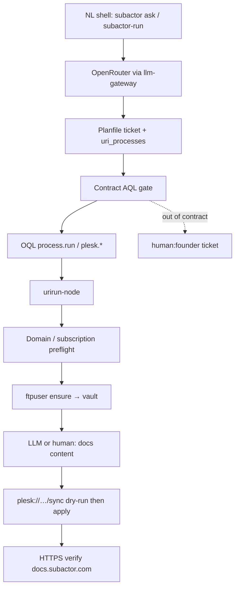

---
{
  "schema": "subactor.doc/v1",
  "id": "docs.autonomy-cli-runbook",
  "version": 1,
  "status": "current",
  "updated": "2026-07-19"
}
---

# Autonomy CLI runbook — connector goals from the shell

Practical runbook: how Subactor turns a natural-language (NL) goal into
governed URI Process steps, starting from the **shell CLI**. Focus example:
documentation in the `docs` repo published to **docs.subactor.com** `httpdocs`.

Related (platform-internal, more detailed on single concerns):

| Doc | Scope |
| --- | --- |
| [`platform/docs/URI_PROCESS_AUTONOMY.md`](../platform/docs/URI_PROCESS_AUTONOMY.md) | Contract AQL / OQL / URI layers |
| [`platform/docs/GITHUB_PLESK_URI_PROCESSES.md`](../platform/docs/GITHUB_PLESK_URI_PROCESSES.md) | GitHub + Plesk recipes, www sync |
| [`platform/docs/AUTONOMY_CONTRACTS.md`](../platform/docs/AUTONOMY_CONTRACTS.md) | Autonomy contracts + delegation |
| [`www/deployment/PLESK.md`](../www/deployment/PLESK.md) | www → subactor.com httpdocs (working path) |
| [`orchestrator/README.md`](../orchestrator/README.md) | Thin NL\|ticket\|OQL → urirun hub |

---

## 1. Current state (what works)

### Stack map

| Layer | Where | Role | Status (after recent `www/` publish) |
| --- | --- | --- | --- |
| Founder CLI | `platform/bin/subactor` (PATH: `~/.local/bin/subactor`) | NL ask → control `:8091`, tickets, plans, REST proxy | Works when platform is up + `SUBACTOR_ADMIN_TOKEN` |
| Orchestrator CLI | `orchestrator/bin/subactor-run.mjs` | Recipe / ticket / stub-NL → AQL gate → urirun | Works for known recipes; NL is **stub** (no free-form URI invent) |
| Control / panel | `:8091` | Plans, autonomy contracts, integrations, delegation | Local Docker stack |
| Planfile | `:8765` + `.planfile/` | Tickets with `uri_processes` | Import recipes work (e.g. www sync) |
| AQL / contracts | `contracts/`, runtime | WHO may run WHAT | Portfolio + TestQL validation |
| OQL | control / bridge | WHAT (`process.run`, `plesk.site.sync`, …) | Dry-run planners; apply via urirun |
| URI / urirun | `connectors/services/urirun-node` | HOW (`plesk://…`, `github://…`) | Live Plesk sync path proven for **www** |
| OpenRouter | `agents` llm-gateway | Intent / planning only | Optional; deterministic connectors do FTP/SFTP |
| Vault | browser-agent / encrypted entries | Credentials (`plesk-runtime`, `plesk-sftp`, …) | Bootstrap + lease model exists |
| Plesk sync | `plesk://host/site/command/sync` | Tree upload to `/httpdocs` | **www → subactor.com** dry-run + apply (gate `PLESK_SYNC_APPLY=1`) |

### CLI entry points (start here)

```bash
# Founder control plane (needs live platform :8091)
ln -sfn ~/github/subactor/platform/bin/subactor ~/.local/bin/subactor
subactor health
subactor ask "zsynchronizuj www do httpdocs"          # LLM intent → ticket/plan
subactor ask "..." --execute                          # approve + execute
subactor ask "..." --autonomous <contract_id>         # within contract bounds
subactor tickets
subactor plans --status proposed
subactor dispatch

# Thin orchestrator (recipe-first; no OpenRouter key in this package)
cd ~/github/subactor/orchestrator
node bin/subactor-run.mjs --recipe ../www/deployment/www-httpdocs-sync.urirun.json
node bin/subactor-run.mjs --nl "zsynchronizuj www"    # phrase stub only
# Founder bypass: SUBACTOR_ADMIN_TOKEN set → human_approval skipped; still dry-run by default
# Live apply: --execute + PLESK_SYNC_APPLY=1 on urirun-node
```

### What already works for publish

| Capability | Current | Notes |
| --- | --- | --- |
| Probe SFTP/FTP | `plesk://host/site/query/methods` | Deterministic |
| Dry-run sync | `plesk://host/site/command/sync` `apply=false` | Default; hashes + file plan |
| Apply sync | same URI `apply=true` + `PLESK_SYNC_APPLY=1` | Env gate, not LLM |
| Source allowlist | basename `www` **or** `docs` **or** `PLESK_SYNC_ALLOWED_SOURCES` | docs allowlisted |
| NL phrases (www + docs) | `agents/nlp-uri-phrases.yaml` | Polish/English sync phrases → dry-run URI |
| Recipe + Planfile import | `www/deployment/www-httpdocs-sync.*`, `docs/deployment/docs-httpdocs-sync.*` | Reusable ticket shapes |
| Founder CLI bypass | `SUBACTOR_ADMIN_TOKEN` on `subactor-run` | Allowlist `*`; still respects apply env |

OpenRouter role today: **intent / model selection / plan proposal only**.
Once URI + payload are known, FTP/SFTP ensure and sync are **deterministic
connector calls** — no LLM in the upload path.

---

## 2. Gaps (better autonomy + subtask delegation)

| Gap | Why it blocks the docs goal | Target |
| --- | --- | --- |
| Auto-create SFTP from subscription | Vault entries often hand-bootstrapped | `plesk://host/ftpuser/command/ensure` → vault `plesk-sftp` as a first URI step |
| Multi-repo / multi-domain sync | Allowlist is `www`-centric | Allow `docs` (and prefixes) for `docs.subactor.com` |
| Docs recipe | Only www recipe exists | `docs-httpdocs-sync.urirun.json` + Planfile import |
| NL routing for multi-step goals | Stub NL / single-intent models | Decompose NL → ordered `uri_processes` + content subtask |
| Content generation into `docs/` | Manual / external editor | Optional LLM step → write files → commit; sync stays deterministic |
| Domain / subscription capability | Manual Plesk UI / API | Preflight URI: domain exists, TLS, httpdocs writable |
| Vault lease in CLI path | Integrations UI / secret-link | CLI/recipe can ensure-then-lease without pasting secrets |
| Founder vs bot allowlists | Admin `*` vs bot `plesk://*` | Document + TestQL: founder bypass ≠ bot expand |
| Delegation of subtasks | Ticket respond/delegate exists | Auto-split: content bot vs publish bot vs human TLS check |
| HTTPS verify | Manual curl | URI or OQL health check after apply |

---

## 3. Proposed model — NL only example

User says only:

> „stwórz dokumentację w folderze docs i repo docs i opublikuj dokumentację
> dla systemu subactor pod domeną docs.subactor.com”

### Pipeline (target)



### Ordered steps (current vs target)

| # | Step | Current | Target | LLM? |
| --- | --- | --- | --- | --- |
| 0 | Parse NL → intent + fields | `subactor ask` / intent models; orchestrator NL stub | Same + multi-goal decomposition (docs content + publish) | Yes (intent only) |
| 1 | Open Planfile ticket with `uri_processes` | Manual import / www recipe | Auto from NL + recipe template `docs-httpdocs-sync` | No (template fill) |
| 2 | AQL gate | Contracts + founder bypass | Same; docs publish under `ALLOW URI_PROCESS plesk://*` | No |
| 3 | Ensure domain / subscription | Manual / Integrations UI | `plesk://…` query (domain, hosting, TLS flags) | No |
| 4 | Ensure SFTP → vault | Documented URI; often manual | Always first automated step before sync | No |
| 5 | Generate/update docs in `docs/` | Human / Cursor | Optional content bot; commit to `subactor/docs` | Optional |
| 6 | Sync dry-run | Works for **www**; not for docs allowlist | Same URI, `source_dir=…/docs`, domain `docs.subactor.com` | No |
| 7 | Sync apply | `PLESK_SYNC_APPLY=1` | Same gate; founder may `--execute` | No |
| 8 | Verify HTTPS | Manual | Curl/health URI; fail → ticket | No |

---

## 4. Where the LLM participates vs deterministic steps

| Phase | Actor | Tooling | LLM |
| --- | --- | --- | --- |
| Intent extraction | llm-gateway → OpenRouter | `subactor ask`, `/api/llm/intent` | **Yes** — typed JSON intent / model id |
| Plan shape | orchestrator / control | recipe + `uri_processes` | Prefer **no** — fill known recipe |
| Contract check | runtime AQL | `contractChecker` | No |
| Credential ensure | urirun Plesk connector | `plesk://host/ftpuser/command/ensure` | No |
| File sync | urirun Plesk connector | `plesk://host/site/command/sync` | No |
| Docs prose / structure | optional content agent | write into `docs/` git | **Optional** |
| Escalation text | control / Planfile | ticket response | Optional |

**Rule:** OpenRouter never holds FTP/SFTP passwords and never performs upload.
Connectors read vault leases; apply requires explicit env gate.

---

## 5. USER vs SYSTEM — APIs / languages / CLIs

Start from the shell. Prefer deterministic CLIs when the URI is already known.

| Step | USER does | SYSTEM does | CLI / API / language |
| --- | --- | --- | --- |
| Bootstrap PATH + token | Symlink CLI; set `SUBACTOR_ADMIN_TOKEN` in `platform/.env` | — | bash: `subactor` |
| Health | `subactor health` | Control `:8091` | HTTP GET `/health` |
| NL goal | Types Polish/English sentence | Intent → ticket → proposed plan | `subactor ask "…"` → POST control LLM + Planfile |
| Or skip LLM | Pass recipe path | Load `uri_processes`, topo-run | `node bin/subactor-run.mjs --recipe …` |
| Approve / autonomy | `--execute` or `--autonomous <id>` or panel approve | AQL check; dispatch | CLI flags / REST `/api/plans/*` |
| Founder bypass | Export admin token | Skip `human_approval`; widen URI allowlist | env `SUBACTOR_ADMIN_TOKEN` |
| Ensure SFTP | Once: approve high-risk step if contract requires | Create user, write vault entry | URI `plesk://host/ftpuser/command/ensure` via urirun `POST /run` |
| Content | Reviews PR/diff or writes docs | Optional LLM write + git commit | git in `docs/` repo; not urirun |
| Dry-run sync | Reviews file plan / hashes | Plan only | URI sync `apply=false` |
| Live sync | Sets `PLESK_SYNC_APPLY=1` on node (or founder policy) | Upload via SFTP/FTP | URI sync `apply=true` |
| Verify | Spot-check browser | Optional automated GET | `curl -fsS https://docs.subactor.com/` |
| Out of scope | Maintains preauthorized mandates/providers | Resolution Engine selects actor/provider and monitors SLA | Planfile + authority graph |

### Languages / packages (no secrets in docs)

| Concern | Package / path |
| --- | --- |
| Shell founder CLI | `platform/bin/subactor` (bash → curl → `:8091`) |
| Orchestrator | `@subactor/orchestrator` — JS (`runTask`) |
| Bridge OQL planner | `connectors/services/bridge` — `planHttpdocsSync` |
| Plesk connector | `urirun-connector-plesk` (external) — Python `site_sync` |
| Phrases | `agents/nlp-uri-phrases.yaml` |
| Contracts | `contracts/**/*.contract.aql` |

---

## 6. Concrete flow — docs → docs.subactor.com

Mirror of the proven **www → subactor.com** path, adapted for docs.

### 6.1 Preconditions

| Check | Current | Target |
| --- | --- | --- |
| Domain `docs.subactor.com` on Plesk subscription | Assumed / CNAME in repo | Preflight URI confirms |
| Vault `plesk-sftp` (or ftp) | Often manual | `ftpuser/command/ensure` |
| Allowlist includes docs tree | **Gap** (`www` only by default) | `PLESK_SYNC_ALLOWED_SOURCES` includes docs path **or** basename `docs` |
| Recipe | Missing | Add beside www recipe |
| `CNAME` / site files in `docs/` | Present (`docs.subactor.com`) | Keep; sync preserves remote `.htaccess` / `.well-known` |

### 6.2 Target recipe shape (illustrative — no secrets)

```json
{
  "id": "docs-httpdocs-sync",
  "name": "Sync docs → Plesk httpdocs (docs.subactor.com)",
  "situation": {
    "source_dir": "/home/tom/github/subactor/docs",
    "host": "prototypowanie.pl",
    "domain": "docs.subactor.com"
  },
  "uri_processes": [
    {
      "id": "docs-domain-preflight",
      "uri": "plesk://host/api/query/request",
      "payload": {"path": "/api/v2/domains"},
      "human_approval": false
    },
    {
      "id": "docs-sftp-ensure",
      "uri": "plesk://host/ftpuser/command/ensure",
      "payload": {
        "kind": "system",
        "domain": "docs.subactor.com",
        "vault_entry_id": "plesk-sftp"
      },
      "depends_on": ["docs-domain-preflight"],
      "human_approval": true
    },
    {
      "id": "docs-methods",
      "uri": "plesk://host/site/query/methods",
      "payload": {"host": "prototypowanie.pl"},
      "depends_on": ["docs-sftp-ensure"],
      "human_approval": false
    },
    {
      "id": "docs-sync-dry-run",
      "uri": "plesk://host/site/command/sync",
      "payload": {
        "source_dir": "/home/tom/github/subactor/docs",
        "remote_path": "/httpdocs",
        "host": "prototypowanie.pl",
        "domain": "docs.subactor.com",
        "apply": false
      },
      "depends_on": ["docs-methods"],
      "human_approval": false
    },
    {
      "id": "docs-sync-apply",
      "uri": "plesk://host/site/command/sync",
      "payload": {
        "source_dir": "/home/tom/github/subactor/docs",
        "remote_path": "/httpdocs",
        "host": "prototypowanie.pl",
        "domain": "docs.subactor.com",
        "apply": true
      },
      "depends_on": ["docs-sync-dry-run"],
      "human_approval": false
    }
  ]
}
```

Content generation (LLM) is a **separate** preceding ticket or plan step writing
into the git repo — not an argument to `sync`.

### 6.3 Operator cheat sheet (today → tomorrow)

**Today (www pattern, adapt manually for docs):**

```bash
# 1) Prefer recipe without inventing URI
cd ~/github/subactor/orchestrator
node bin/subactor-run.mjs --recipe ../www/deployment/www-httpdocs-sync.urirun.json

# 2) Or founder NL → control (intent only)
subactor ask "zsynchronizuj www do httpdocs" --json

# 3) Live apply only after dry-run OK
# on urirun-node host: export PLESK_SYNC_APPLY=1
node bin/subactor-run.mjs --recipe ../www/deployment/www-httpdocs-sync.urirun.json --execute
```

**Tomorrow (docs autonomy):**

```bash
# NL (intent → multi-step ticket)
subactor ask "stwórz dokumentację w folderze docs i opublikuj na docs.subactor.com" \
  --autonomous <docs-publish-contract-id>

# Or deterministic
node bin/subactor-run.mjs --recipe ../docs/deployment/docs-httpdocs-sync.urirun.json
# content bot ticket completes first; then:
node bin/subactor-run.mjs --recipe ../docs/deployment/docs-httpdocs-sync.urirun.json --execute
curl -fsS -o /dev/null -w "%{http_code}\n" https://docs.subactor.com/
```

### 6.4 Allowlist / safety

| Control | Mechanism |
| --- | --- |
| Source dirs | basename allowlist / `PLESK_SYNC_ALLOWED_SOURCES` |
| Live upload | `PLESK_SYNC_APPLY=1` on urirun-node |
| Who may call | Contract AQL `ALLOW URI_PROCESS plesk://*` |
| Irreversible creds | `human_approval: true` on ensure (unless founder admin policy) |
| Secrets | Vault entries only; never in URI payload, tickets, or this doc |

---

## 7. Subtask delegation (autonomy pattern)

| Subtask | Preferred actor | Queue | Approval |
| --- | --- | --- | --- |
| Intent / plan proposal | bot + LLM gateway | system | none (propose only) |
| SFTP ensure | `bot:project-operator-bot` | bot | human once / founder contract |
| Docs content | content bot or human | docs | review diff |
| Sync dry-run | project-operator-bot | bot | none |
| Sync apply | project-operator-bot | bot | env gate (or human) |
| HTTPS / DNS fail | escalate | `human:founder` | decision |

Use Planfile **Respond + Delegate** so note, assignee, queue, and status stay
one history entry (see URI Process autonomy doc).

---

## 8. Implementation backlog (docs publish autonomy)

Ordered, small tickets — one concern each:

1. Allowlist `docs` (or prefix) for sync planner + connector.
2. Add `docs/deployment/docs-httpdocs-sync.urirun.json` + Planfile import.
3. Wire `ftpuser/command/ensure` as first step; vault id convention.
4. NL phrases + optional LLM model `docs-httpdocs-sync.pl.aql`.
5. Optional content-generation ticket template (LLM → files → commit).
6. Post-apply HTTPS verify step / TestQL scenario.
7. Contract portfolio entry for docs publish (human-signed).

---

## 9. Quick reference — OpenRouter vs connectors

| | OpenRouter (LLM) | Connectors (urirun) |
| --- | --- | --- |
| Job | Intent, planning, optional prose | FTP/SFTP ensure, sync, API queries |
| Called from | llm-gateway / `subactor ask` | urirun-node `POST /run` |
| Sees secrets? | No | Via vault lease only |
| Can upload httpdocs? | No | Yes, if apply gate set |
| Failure mode | Deterministic fallback / escalate | Structured error codes → ticket |

---

*Canonical path: `docs/autonomy-cli-runbook.md` (this file). Umbrella link: repo root `README.md`.*
